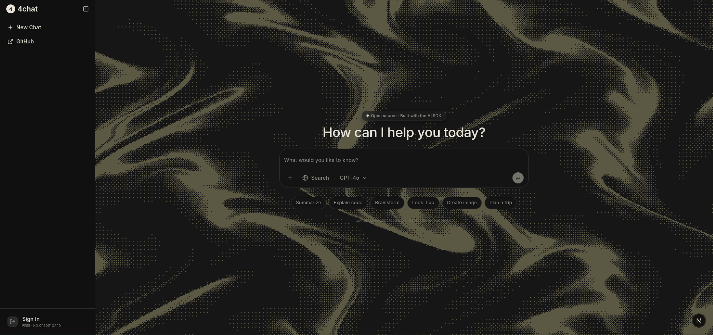

<div align="center">

# 4chat

An open source AI chat interface built with Next.js, the AI SDK, and shadcn/ui. Minimal, fast, and yours to extend.



</div>

## About

4chat is a clean, self hosted starting point for building your own AI chat product. It ships with a real streaming chat flow, a searchable model picker, reasoning and source display, file attachments, screenshot capture, and a component library built entirely on shadcn/ui and the Vercel AI SDK. There is no backend service, no account system, and no telemetry baked in. It is meant to be read, forked, and shaped into whatever you are building next.

## Features

- Streaming chat powered by the AI SDK, with support for reasoning tokens, cited sources, and web search
- A searchable, keyboard friendly model picker with per provider grouping and logos
- File and image attachments, drag and drop, and in browser screenshot capture
- A large catalog of prebuilt AI UI primitives under `components/ai-elements` (messages, tool calls, code blocks, artifacts, terminals, and more)
- Light and dark themes out of the box, fully responsive from mobile to desktop
- A single place to edit the system prompt (`lib/system-prompt.ts`) and the list of available models (`lib/models.ts`)

## Tech stack

- [Next.js](https://nextjs.org) (App Router)
- [React](https://react.dev)
- [AI SDK](https://ai-sdk.dev)
- [shadcn/ui](https://ui.shadcn.com) and [Radix UI](https://www.radix-ui.com)
- [Tailwind CSS](https://tailwindcss.com)
- [TypeScript](https://www.typescriptlang.org)

## Getting started

Clone the repository and install dependencies:

```bash
git clone https://github.com/moazamdotdev/4chat.git
cd 4chat
bun install
```

### API key

The chat route (`app/api/chat/route.ts`) calls `streamText` from the AI SDK with a plain `"provider/model"` string, for example `deepseek/deepseek-v4-flash`. When no explicit provider instance is passed like that, the AI SDK routes the request through the [Vercel AI Gateway](https://vercel.com/docs/ai-gateway), which gives you access to every model listed in `lib/models.ts` through a single key instead of signing up with each provider separately.

To get a key:

1. Create a free account at [vercel.com](https://vercel.com).
2. Open the [AI Gateway dashboard](https://vercel.com/dashboard/ai-gateway) and create an API key.
3. Add it to a `.env.local` file in the project root:

   ```bash
   AI_GATEWAY_API_KEY=your-key-here
   ```

If you would rather call a provider directly (OpenAI, Anthropic, and so on), install its AI SDK package and swap the plain model string in `app/api/chat/route.ts` for that provider's model instance.

Run the development server:

```bash
bun dev
```

Open [http://localhost:3000](http://localhost:3000) to see the app.

## Project structure

```
app/
  api/chat/        Chat streaming endpoint
  c/[id]/           Individual chat page
  page.tsx          Home page
components/
  ai-elements/      AI SDK UI primitives (messages, tools, reasoning, artifacts, ...)
  home/             App specific composition (sidebar, model picker, home page)
  ui/               shadcn/ui primitives
lib/
  models.ts         List of models shown in the model picker
  system-prompt.ts  The assistant's system prompt
  site.ts           Site metadata
```

## Configuration

- **Models** — edit `lib/models.ts` to add, remove, or reorder the models shown in the picker.
- **System prompt** — edit `lib/system-prompt.ts` to change how the assistant behaves.
- **Chat route** — `app/api/chat/route.ts` wires the selected model into `streamText` from the AI SDK; point it at whichever provider or gateway you use.

## Contributing

Issues and pull requests are welcome. If you are proposing a larger change, please open an issue first to discuss what you would like to change.

## License

Released into the public domain under [The Unlicense](LICENSE). Do whatever you want with it, no attribution required.
